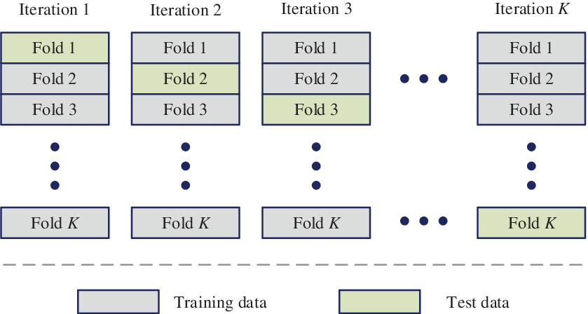

```{r setup, include=FALSE}
knitr::opts_chunk$set(echo = TRUE)
```
<!----------------------------------------------------------------------------->
# INTRODUZIONE AL DATASET
Il dataset contiene informazioni sul censimento delle case effettuato in California nel 1990. Nello specifico, esse riguardano la demografia nei distretti (reddito, popolazione, nuclei familiari), l'ubicazione dei distretti (latitudine, longitudine) e informazioni generali sulle case (numero di stanze, numero di camere da letto , età della casa). Notiamo fin da subito come i dati non siano definiti a livello delle singole case, ma siano invece relativi ai diversi distretti in cui è stata suddivisa la California. Pertanto, i valori di alcune variabili dovranno essere intesi come statistiche complessive del distretto, ad esempio totali, medie, mediane...
<!----------------------------------------------------------------------------->

Per prima cosa, importiamo i dati e analizziamo le dimensioni del dataset:
```{r, echo=T}
data<- read.csv("data/california_housing.csv", header=T)
dim(data)
```

Il dataset presenta ben 20640 record e 10 attributi. Questi ultimi sono:
```{r, echo=T}
colnames(data)
```

<!----------------------------------------------------------------------------->
- **longitude**: la longitudine del distretto. Essa fornisce una misura di quanto ad Ovest esso sia;
- **latitude**: la latitudine del distretto. Essa fornisce una misura di quanto a Nord esso sia;
- **housing_median_age**: il valore mediano dell'età delle case del distretto. Esso fornisce una misura (in anni) del tempo trascorso dalla data di costruzione delle abitazioni alla data del Censimento;
- **total_rooms**: il numero totale di stanze presenti nel distretto;
- **total_bedrooms**: il numero totale di camere da letto presenti nel distretto;
- **population**: il numero di abitanti nel distretto;
- **households**: il numero di nuclei familiari nel distretto;
- **median_income**: il reddito mediano degli abitanti del distretto;
- **median_house_value**: il valore mediano delle case del distretto;
- **ocean_proximity**: variabile qualitativa che misura la distanza del distretto dall'oceano;
<!----------------------------------------------------------------------------->

Il dataset contiene quasi esclusivamente variabili quantitative, eccetto **ocean_proximity** (teniamo presente che in seguito dovremo codificarla in maniera opportuna). Tra tutte le variabili, quella che risulta più indicata da utilizzare come variabile risposta per il nostro modello di regressione è ***median_house_value***.

Per semplicità di trattazione, andremo a rinominarla come **Y**:
```{r, echo=T}
colnames(data)[which(colnames(data)=="median_house_value")]="Y"
```

Ancora prima di effettuare un'analisi esplorativa dei dati, è interessante soffermarsi sulla variabile risposta, evidenziandone fin da subito le carattertiche salienti:
```{r, include=T}
summary(data$Y)
par(mfrow=c(1,2))
hist(data$Y, main="Distribuzione di Y",cex.main=0.8, xlab="Y", col="#3CA494")
boxplot(data$Y,main="Boxplot di Y",horizontal=F,cex.main=0.8, col="#2AAF7F")
```

```{r, include=F}
par(mfrow=c(1,1))
```

Dal summary e i grafici sopra emerge una distribuzione asimmetrica della variabile risposta. Spesso, in questi casi,  si applica una trasformazione alla variabile, ad esempio il logaritmo (caso particolare delle trasformazioni di Box-Cox). Dato che le trasformazioni in generale possono rendere più difficoltosa l’interpretazione del fenomeno, e visto che l’asimmetria della distribuzione di Y non è troppo accentuata rispetto alla scala di misura, ho valutato di non modificare -**per il momento**- la variabile risposta.

La distribuzione di Y nasconde anche un altro aspetto curioso: come rivela l’istogramma, la coda destra della distribuzione presenta una frequenza insolitamente alta (ciò si rispecchia anche negli outliers del boxplot).
```{r}
sum(data$Y == max(data$Y))
max(data$Y)
```

In effetti, ben 965 distretti sui 20640 totali (circa il 4,68%) presentano un prezzo mediano delle case pari a 500001$.
Ciò potrebbe essere imputabile a chi ha fornito il dataset che, probabilmente, nella sua costruzione ha applicato un effetto soglia (*threshold-effect*). Ritengo infatti che originariamente alcuni distretti presentassero valori di Y molto estremi, andando a rendere la distribuzione molto più sbilanciata. Per mantenere una situazione gestibile, pertanto, si sarà detto "Se $Y>500000$, allora poniamo $Y=500001$".

# DATA CLEANING
<!----------------------------------------------------------------------------->
Prima di procedere con l'analisi esplorativa dei dati, è opportuno verificare se il nostro dataframe presenta valori non disponibili (N.A.) o campi vuoti. 
```{r}
na_values<-empty_values<- vector(mode="numeric", length=dim(data)[2])
for (i in 1: dim(data)[2]){
    na_values[i]= sum(is.na(data[,i]))
    empty_values[i]= sum(data[,i] =="", na.rm=T)
}
```
```{r, echo=F, include=T,out.height="300px"}
par(mfrow=c(1,1))
barplot(na_values~colnames(data), horiz=F, xlab="",
        ylab="N.A.", las=3, cex.names=0.5, col="#F11C1C",
        main= "Missing Values")
legend("topleft",c("N.A.", "Empty"), col=c("#F11C1C","orange"),fill=c("#F11C1C","orange"))
```

L'unica variabile che richiede una fase preliminare di data cleaning è **total_bedrooms** (207 *N.A.*). In generale, quando per una variabile quantitativa si è in presenza di valori *N.A.* si può procedere in due modi:

1) eliminando il record
2) imputando un valore

Se da una parte è bene evitare di eliminare "gratuitamente" records dal dataframe, è anche vero che dall'altra non è sempre possibile imputare un valore. Prima bisogna effettivamente capire se la mancanza del dato è significativa oppure no. In altri termini, si tratta di capire se il dato mancante è semplicemente tale, oppure se il fatto che sia mancante rappresenti un'informazione rilevante per determinare la variabile target. Ha quindi senso confrontare come si distribuisce **Y** a seconda che **total_bedrooms** abbia un valore o sia N.A.

```{r,out.height="250px"}
value<- data$Y[which(!is.na(data$total_bedrooms))]
na<- data$Y[which(is.na(data$total_bedrooms))]
summary(value)
summary(na)
boxplot(value,na, horizontal=F,col=c("#8ACF8B","#F11C1C"), ylab="Y", xlab="total_bedrooms")
legend("topleft",c("value", "NA"),col=c("#8ACF8B","#F11C1C"),fill=c("#8ACF8B","#F11C1C"))
var(value)/var(na)
```
\newpage
Il confronto tra i quantili (e le varianze) dei due gruppi ed il boxplot suggeriscono che le due distribuzioni sono molto simili, e ciò significa che i valori mancanti di **total_bedrooms** non hanno un effetto particolare sulla variabile risposta. Ora che abbiamo la conferma di questo, è possibile procedere con l'imputazione:
```{r}
data$total_bedrooms[which(is.na(data$total_bedrooms))]<- median(data$total_bedrooms, na.rm=TRUE)
```

# EDA (Exploratory Data Analysis)

Terminata la fase di data cleaning, si può procedere con un’analisi più approfondita del dataset. 

```{r, echo=F, include=T}
par(mfrow=c(3,3))
for(i in 1:9){
  tit= colnames(data)[i]
  hist(data[,i], main=tit, col="#8EC16D",xlab="")
}
```

## DISTRIBUZIONE DELLE VARIABILI

Concentriamoci innanzitutto sulle distribuzioni delle variabili:

- **median_income** ha un'asimmetria positiva. Ciò è tanto evidente quanto prevedibile: il reddito delle persone è distribuito più o meno normalmente, ma ci sono delle persone che hanno un reddito molto più alto della media;
- **housing_median_age** ha una distribuzione più o meno uniforme (va bene!);
- **Y** come notato in precedenza è asimmetrica e rivela un intrinseco effetto soglia;
- **total_rooms, total_bedrooms, population** e **households** hanno una distribuzione fortemente asimmetrica, e assumono valori in una scala molto più ampia rispetto alle variabili presentate in precedenza. Tali variabili dovranno essere gestite in modo particolare (lo vedremo in seguito);
- **longitude** e **latitude** non presentano particolari anomalie, se non una sorta di "conca" in prossimità dei valori centrali (capiremo tra poco il motivo!);

## I VALORI SONO SENSATI?
Nella fase di analisi esplorativa, oltre a valutare la distribuzione delle variabili, è essenziale capire che valori siano effettivamente contenuti nelle celle del dataframe. Infatti, comprendere in che unità sono espressi i dati che poi inseriremo nel modello è cruciale:
```{r}
head(data,5)
```

- **longitude, latitude** e **house_median_age** presentano valori sensati;
- **total rooms** e **total_bedrooms** sono valori rispettivamente in centinaia e migliaia. Ciò non deve stupirci, in quanto i dati sono riferiti alla totalità delle abitazioni del distretto;
- **population** inizialmente non mi era ben chiara: il dubbio è stato capire in che misura essa fosse quantificata (unità, centinaia, migliaia?). Tuttavia, sapendo che la popolazione della California nel 1990 contava circa 29,95 milioni di abitanti (\emph{fonte Wikipedia}), è bastato fare un semplice check:
```{r}
sum(data$population)
```
la popolazione è quindi espressa come il totale delle persone appartenenti al distretto!

- **household** di conseguenza appare sensato
- **median_income**, invece, non sembra particolarmente sensato. Si veda il summary:
```{r}
summary(data$median_income)
```

Sicuramente non si può trattare di una misura in dollari. Al massimo, se i dati si riferissero al salario annuale, potrebbe aver senso considerare questa variabile in decine di migliaia di dollari.

\newpage
## ocean_proximity
Fino a questo momento abbiamo analizzato solamente le variabili esplicative quantitative, ma il dataset contiene anche una variabile qualitativa: **ocean_proximity**. Essa presenta in tutto 5 categorie (*si veda il grafico sotto*), che forniscono una misura della posizione geografica del distretto.

```{r, warning = FALSE, echo=F, out.width="350px"}
palette<- c("#D35400", "#E59866", "#DD1212", "#641E16", "#F39C12")
library(ggplot2, war)
ggplot(data, aes(longitude, latitude, color = ocean_proximity)) + 
  geom_point() + 
  scale_color_manual(values = palette)
```


**Nota:** come avevamo notato in precedenza, l'istogramma di **latitude** e **longitude** presentava una sorta di "conca", ma ciò non era di facile interpretazione. Il grafico qui sopra invece, combinando le due variabili, fornisce una visualizzazione molto più efficace: la conca dell'istogramma diventa ora una zona senza punti sulla cartina. A primo impatto potremmo pensare che una discreta parte della California all'epoca non fosse stata censita, e ciò andrebbe sicuramente a compromettere il dataset a livello di bias. In realtà la mancanza di punti deriva principalmente dalla pericolosità sismica tipica di quella zona (faglia di Sant'Andreas).

Inoltre, appare evidente la relazione tra **latitude** ,**longitude** e **ocean_proximity**. Nel momento in cui andremo a costruire il modello sarà bene tenerne conto, al fine di evitare multicollinearità.

```{r, echo=T}
table(data$ocean_proximity)
```

Tra queste 5 categorie si distingue indubbiamente "ISLAND", presente in solo 5 distretti. Potrebbe essere sensato valutare di non considerare tale categoria, ma ciò si inserisce in un discorso molto più ampio, che comprende anche tutte le altre categorie. Nello specifico, dovremo considerare **ocean_proximity** non a livello di singola variabile, ma in relazione ai valori assunti da **Y** a seconda delle varie categorie. Tutto questo, ovviamente, lo potremo fare solo dopo aver confermato che effettivamente esista una qualche relazione tra la posizione geografica del distretto e il prezzo mediano delle case ad esso associato. Se non vi fosse alcuna relazione, infatti, potremmo decidere fin da subito di non includere le variabili geografiche nel nostro modello.
\newpage
Il primo passo è dunque stabilire se esiste una qualche relazione tra la posizione geografica del distretto e la variabile risposta:

```{r, warning = FALSE,out.width="350px",echo=F}
ggplot(data, aes(longitude, latitude, color = Y)) + 
  geom_point()
```

Appurato che una relazione esiste (*il grafico sopra suggerisce una relazione positiva tra Y e la vicinanza all'oceano*), si può procedere analizzando come si distribuisce **Y** nei vari livelli di **ocean_proximity**

```{r, echo=F, out.width="350px"}
boxplot(data$Y ~data$ocean_proximity, cex.axis=0.8, col=palette, xlab="", ylab="Y")
```


Questo boxplot sembrerebbe confermare quanto intuito nel grafico precedente, ossia pare esserci una relazione positiva tra Y e la vicinanza all'oceano, e ciò è evidente soprattutto considerando le modalità "INLAND" e "ISLAND". Nel primo caso il prezzo mediano delle abitazioni dell'entroterra appare in media molto più basso rispetto alle altre categorie; nelle isole invece vale il contrario, ma teniamo sempre presente questa categoria presenta una numerosità davvero minima. Per quanto riguarda invece le categorie "<1H OCEAN", "NEAR BAY" e "NEAR OCEAN" la differenza in media non sembra così rilevante, e ciò potrebbe avere conseguenze a livello di nullità dei coefficienti del modello.

Tuttavia, **trarre conclusioni da un boxplot è un approccio troppo ingenuo**: è necessario approfondire la questione. A tal proposito, definiamo per $i=1,...,n$ le seguenti variabili indicatrici:

$$ \begin{aligned}
  x_{i2}&=\begin{cases} 1 \text{ se l'unità i ha ocean\_proximity = "INLAND"}\\0 \text{ altrimenti} \end{cases}\\
  x_{i3}&=\begin{cases} 1 \text{ se l'unità i ha ocean\_proximity = "ISLAND"}\\0 \text{ altrimenti} \end{cases}\\
  x_{i4}&=\begin{cases} 1 \text{ se l'unità i ha ocean\_proximity = "NEAR BAY"}\\0 \text{ altrimenti} \end{cases}\\
  x_{i5}&=\begin{cases} 1 \text{ se l'unità i ha ocean\_proximity = "NEAR OCEAN"}\\0 \text{ altrimenti} \end{cases}
\end{aligned}$$

e consideriamo il modello $Y_i = \beta_1 + \beta_2 x_{i2}+ \beta_3 x_{i3}+ \beta_4 x_{i4}+ \beta_5 x_{i5} + \epsilon_i$. L'interpretazione dei parametri sarà:

- $\beta_1$ è la media di Y in un distretto appartenente alla classe "<1H OCEAN";
- $\beta_2$ è la differenza tra la media di Y in un distretto appartenente a "INLAND" e la media di Y in un distretto appartenente a "<1H OCEAN";
- $\beta_3$ è la differenza tra la media di Y in un distretto appartenente a "ISLAND" e la media di Y in un distretto appartenente a "<1H OCEAN";
- $\beta_4$ è la differenza tra la media di Y in un distretto appartenente a "NEAR BAY" e la media di Y in un distretto appartenente a "<1H OCEAN";
- $\beta_5$ è la differenza tra la media di Y in un distretto appartenente a "NEAR OCEAN" e la media di Y in un distretto appartenente a "<1H OCEAN";

```{r}
data$ocean_proximity = factor(data$ocean_proximity)
fit_ocean<- lm(Y~ocean_proximity, data=data)
summary(fit_ocean)
```
Il test di nullità sui singoli coefficienti rivela che essi sono tutti significativamente diversi da 0. Ha dunque senso supporre che vi sia una differenza in media significativa tra i 5 gruppi. Inoltre, facciamo presente che oltre al p-value è sempre bene valutare anche lo standard error dei coefficienti: se lo s.e. è molto elevato e non c'è una particolare ragione di includere la variabile, potrebbe aver senso escluderla dal modello. Tra i nostri coefficienti, risulta uno s.e. molto elevato nel gruppo "ISLAND". Ricordiamo anche che tale categoria è presente in sole 5 osservazioni del dataset. Per questi due motivi, si potrebbe decidere di non includere tale variabile nel modello. Allo stesso tempo, ricordiamo che il grande dubbio che ci ha condotti a questa analisi riguardava le categorie 
"<1H OCEAN", "NEAR BAY" e "NEAR OCEAN". Se da un lato il boxplot non sembrava evidenziare differenze in media significative, dall'altro il test appena effettuato suggerirebbe il contrario. Possiamo dunque effettuare un terzo test sul confronto tra i seguenti modelli annidati:
$$ 
\begin{aligned}
M_0&: Y_i = \beta_1 + \beta_2 x_{i2}+ \beta_3 x_{i3} + \epsilon_i\\
M_1&: Y_i = \beta_1 + \beta_2 x_{i2}+ \beta_3 x_{i3}+ \beta_4 x_{i4}+ \beta_5 x_{i5} + \epsilon_i
\end{aligned}
$$
Si tratta dunque di verificare l'ipotesi nulla $H_0: \beta_4 = \beta_5 =0$ che, in termini, è del tutto equivalente all'ipotesi che il modello ridotto ($M_0$) sia migliore del modello completo ($M_1$).

Per farlo è necessario codificare **ocean_proximity** in modo diverso. Senza andare a modificare il dataset originale, ho valutato fosse opportuno creare un dataframe apposito per quest'analisi.
```{r}
Y<- data$Y
inland<- data$ocean_proximity=="INLAND"
island<- data$ocean_proximity=="ISLAND"
nearbay<- data$ocean_proximity=="NEAR BAY"
nearocean<- data$ocean_proximity=="NEAR OCEAN"
ocean_data<- data.frame(cbind(Y, inland, island, nearbay, nearocean))
```

**NB:** la categoria "<1H OCEAN" non è stata inclusa, in modo da interpretarla come intercetta del modello!

A questo punto è stato possibile procedere al confronto tra i modelli $M_0$ ed $M_1$, tramite **anova**:

```{r}
M1= lm(Y~.,ocean_data)
M0= lm(Y~inland+island,ocean_data)
anova(M0,M1,test='F')
```

L'analisi della varianza rivela una forte evidenza contro l'ipotesi nulla, dunque tra i due modelli quello che risulta migliore è il modello completo $M_1$. In altri termini, le differenze in media di **Y** tra le varie categorie sono tutte significative, anche se resta comunque una certa diffidenza verso la categoria "ISLAND".

**NOTA:** in generale, per poter applicare questi metodi, è necessario che a monte siano verificate alcune ipotesi. I dati a disposizione purtroppo non le rispettavano, quindi le conclusioni a cui siamo giunti devono essere considerate con cautela. Allo stesso tempo però, pur applicando trasformazioni varie la situazione non è migliorata: non avrei saputo cos'altro fare per poter valutare le differenze in media tra gruppi.
\newpage

# FEATURE SELECTION

Passiamo ora a una tra le fasi più complesse della costruzione del modello: la *selezione delle variabili*.

Capire che variabili includere nel modello è fondamentale, ma allo stesso tempo non esistono procedure standard per farlo. Spesso si sfruttano alcuni criteri di informazione (AIC, BIC, Cp);altre volte si confrontano direttamente i modelli. Tuttavia, alcune semplici accortezze in fase di analisi esplorativa possono semplificare notevolmente le cose nel seguito. Nello specifico, ho voluto risolvere a monte il problema della *multicollinearità*. Valutiamo dunque come sono correlate tra loro le variabili:

```{r, echo=F, include=F}
library(corrplot)
```
```{r, echo=F, include=T}
corrplot(cor(data[,-which(colnames(data)=="ocean_proximity")]),type="upper",method="color", 
         addgrid.col = "black",tl.col="black",tl.cex = 0.7,addCoef.col = "black",
         number.cex=0.7,col = COL1("Greens"), order="alphabet")
```

Concentriamoci innanzitutto sulla correlazione tra le sole variabili esplicative:

- **longitude** e **latitude** sono molto correlate, ma allo stesso tempo non avrebbe senso prenderle singolarmente;
- **population, households, total_bedrooms** e **total_rooms** sono variabili fortemente correlate, ed in realtà potevamo aspettarcelo;
- le altre variabili fortunatamente non presentano correlazioni rilevanti;

La correlazione tra **longitude** e **latitude** può essere facilmente evitata inserendo nel modello la variabile geografica **ocean_proximity**. È inoltre evidente che non si possono includere insieme le variabili **population, households, total_bedrooms** e **total_rooms**, ma come si può decidere cosa escludere?

La scelta non è così banale. Tutte le variabili sono legate alla dimensione della popolazione, ma escludere **population** non risolverebbe il problema, poichè  **total_bedrooms** e **total_rooms** sarebbero comunque correlate a **households**. Escludere pure quest'ultima non aiuterebbe, perchè il totale delle stanze sarebbe comunque legato al totale delle camere da letto (d'altronde sempre di stanze si tratta). 

La soluzione sembrerebbe quindi selezionare una sola di queste 4 grandezze. In realtà si può fare di meglio!

## FEATURE ENGINEERING
Il *feature engineering* è un processo di creazione, trasformazione e selezione delle variabili (features) presenti nei dati grezzi, e può influire notevolmente sulle prestazioni di un modello. Tale processo viene adottato in generale per fornire al modello informazioni più significative e, auspicabilmente, per migliorare la sua capacità previsiva. A partire dai dati, ho dunque costruito 3 nuove grandezze:

1) **rooms_per_household**: si tratta del rapporto tra il totale delle stanze e il numero di famiglie del distretto. Esso fornisce una misura delle stanze per famiglia nel distretto considerato;
2) **bedrooms_per_room**: si tratta del numero di camere da letto in rapporto al numero totale di stanze;
3) **pop_per_household**: si tratta della popolazione del distretto rapportata al numero di famiglie dello stesso. Esso fornisce una misura della densità di popolazione del distretto;

```{r}
data$rooms_per_household<- data$total_rooms / data$households
data$bedrooms_per_room<- data$total_bedrooms / data$total_rooms
data$pop_per_household<- data$population / data$households
```

**LE NUOVE VARIABILI SONO PIÙ SIGNIFICATIVE PER Y ?**

Confronto tra **total_rooms** e **rooms_per_household**
```{r}
cor(data$total_rooms, data$Y)
cor(data$rooms_per_household, data$Y)
```

La nuova variabile, anche se di poco, è più correlata alla variabile risposta!

Confronto tra **total_bedrooms** e **bedrooms_per_room**
```{r}
cor(data$total_bedrooms, data$Y)
cor(data$bedrooms_per_room, data$Y)
```

La nuova variabile è decisamente più correlata alla variabile risposta. Inoltre, notiamo come il segno della correlazione sia diventato negativo, ossia al diminuire del rapporto camere/stanze il valore della casa aumenta. Ciò potrebbe avere senso, in quanto case dal valore elevato è probabile che abbiano stanze "accessorie" (*studi, bagni privati, mansarde,...*) che, aumentando il denominatore, riducono tale rapporto.
\newpage
**LE NUOVE VARIABILI SONO CORRELATE TRA LORO ?**
```{r}
cor(data$rooms_per_household, data$pop_per_household)
cor(data$bedrooms_per_room, data$pop_per_household)
cor(data$rooms_per_household, data$bedrooms_per_room)
```

**rooms_per_household** e **bedrooms_per_room** sono pressochè incorrelate con **pop_per_household**, mentre in precedenza sia **total_rooms** sia **total_bedrooms** erano molto correlate a **population**. Inoltre, se prima **total_rooms** e **total_bedrooms** avevano una correlazione di circa $0.93$, ora la correlazione tra **rooms_per_household** e **bedrooms_per_household** risulta soltanto $-0.37$.

Grazie a queste procedure preliminari abbiamo eliminato sul nascere i problemi di multicollinearità, e la situazione è nettamente migliorata. La matrice di correlazione tra le esplicative è diventata infatti:

```{r, echo=F, include=T}
index= which(colnames(data)== "housing_median_age" | colnames(data)== "median_income" |
             colnames(data)== "bedrooms_per_room" | colnames(data)== "rooms_per_household"| 
             colnames(data)== "pop_per_household" | colnames(data)== "Y")

corrplot(cor(data[,index]),type="upper",method="color", 
         addgrid.col = "black",tl.col="black",tl.cex = 0.7,addCoef.col = "black",
         number.cex=0.7,col = COL1("Greens"),order="alphabet")

```

# MODELLI
```{r, echo=T}
#dividiamo test set e training set
set.seed(1)
sample<- sample(c(TRUE,FALSE), nrow(data), replace=TRUE, prob=c(0.8,0.2))
original_data<- data
test<- data[!sample,]
data<- data[sample,]
```


## Modello con tutte le esplicative originali
```{r}
fit_originale<- lm(Y~ longitude+latitude+housing_median_age+total_rooms+
                              total_bedrooms+households+population+median_income+
                              ocean_proximity, data=data)
require(MASS)
fit_originale<- stepAIC(fit_originale, direction="both")
summary(fit_originale)
```

Questo modello sicuramente non è adatto, è stato inserito solamente come punto di partenza. 

Osserviamo che:

- tutti i coefficienti sono significativi ad un livello di significatività $\alpha = 0.05$;
- la procedura *stepAIC()* ha mantenuto tutte le variabili, senza scartarne alcuna;
- l' $R_{adj}^2$ è risultato 0.6424;
- come analizzato in precedenza, c'è forte presenza di multicollinearità;


## Modello con le nuove variabili (e ocean_proximity)
```{r}
fit_newvars<- lm(Y~ housing_median_age+median_income+rooms_per_household+
                              bedrooms_per_room+pop_per_household+
                              ocean_proximity, data=data)
summary(fit_newvars)
```

- tutti i coefficienti sono significativi;
- rimane sempre il dubbio se includere la categoria "ISLAND" (s.e. molto elevato);
- la procedura *stepAIC* (anche se non inserita nel report) mantiente tutte le variabili;
- l' $R_{adj}^2$ è peggiorato rispetto a prima, risultando 0.6036 ;
- il modello non presenta problemi di multicollinearità;

## Modello con le variabili trasformate
Nel modello precedente alcune esplicative hanno una distribuzione molto asimmetrica:

```{r, echo=F, include=T}
par(mfrow=c(2,2))
hist(data$median_income,main="Median Income", col="#8EC16D", xlab="")
hist(data$rooms_per_household,main="rooms_per_household", col="#8EC16D", xlab="", breaks=70)
hist(data$bedrooms_per_room,main="bedrooms_per_room", col="#8EC16D", xlab="", breaks=70)
hist(data$pop_per_household,main="pop_per_household", col="#8EC16D", xlab="", breaks=1000, xlim=c(0,50))
par(mfrow=c(1,1))
```
\newpage

Passiamo dunque ai logaritmi (avevo provato anche altre combinazioni,ma il log è stata la migliore):

```{r}
data$log_median_income<- log(data$median_income)
data$log_rooms_per_household<- log(data$rooms_per_household)
data$log_bedrooms_per_room<- log(data$bedrooms_per_room)
data$log_pop_per_household<- log(data$pop_per_household)
data$log_Y<- log(data$Y)
test$log_median_income<- log(test$median_income)
test$log_rooms_per_household<- log(test$rooms_per_household)
test$log_bedrooms_per_room<- log(test$bedrooms_per_room)
test$log_pop_per_household<- log(test$pop_per_household)
test$log_Y<- log(test$Y)
```

```{r}
fit_log<- lm(log_Y~housing_median_age + log_median_income+ log_rooms_per_household+
               log_bedrooms_per_room+log_pop_per_household+ocean_proximity, data=data)
summary(fit_log)
```
- "NEAR BAY" e "NEAR_OCEAN" non sono significativi;
- *log_rooms_per_household* è significativo usando un livello di significatività da 0.01 in poi;
- l' $R_{adj}^2$ è migliorato rispetto ad entrambi i modelli precedenti, risultando 0.6662;
- NB: avevo provato anche a centrare le esplicative nella media [$X_i' = X_i - \overline{X_i}$], ma non è cambiato nulla
- avevo anche provato a standardizzare [$X_i' = \cfrac{X_i - E(X_i)}{\sqrt{V(X_i)}}$], ma ancora niente!
- visto che alcuni coefficienti di ocean erano non significativi, avevo provato a includere longitudine e latitudine sottoforma di rapporto (per evitare collinearità), ma il modello peggiorava significativamente.
\newpage

### PARADOSSO DI SIMPSON

Si ha un paradosso di Simpson quando i dati mostrano un'associazione di un certo tipo tra due variabili se li si guarda condizionatamente ad una terza, ma mostrano l'associazione opposta se si ignora la terza variabile. 

Il coefficiente associato a **log_bedrooms_per_room** è $>0$, dunque l'effetto di tale esplicativa sulla **Y** risulterebbe positivo. Tuttavia, avevamo analizzato in precedenza la correlazione negativa tra queste due variabili, interpretandola come sensata. Allora come mai il coefficiente è positivo?

Effettivamente, se si costruisce il modello partendo da **log_bedrooms_per_room** e si aggiungono man mano le altre esplicative, il coefficiente di **log_bedrooms_per_room** rimane sempre negativo. Nel momento in cui però si include anche la variabile **log_median_income**, ecco che il coefficiente cambia segno. Si tratta di un chiaro esempio di paradosso di Simpson, e possiamo analizzarlo meglio con il seguente grafico:

```{r, include=T,out.width="400px",echo=F}
ggplot(original_data[1:2000,], aes(log(bedrooms_per_room), log(Y), color = log(median_income))) + 
  geom_point()+scale_colour_gradientn(colours=rainbow(20))
```

**Commento:**se consideriamo i dati a livello complessivo, la correlazione tra *log_bedrooms_per_room* e *log_Y* è negativa. Se ci poniamo sui particolari livelli di reddito, invece, la relazione tra le due variabili diventa positiva. Inoltre, possiamo apprezzare come per i livelli centrali del reddito questa correlazione sia molto marcata, mentre nei livelli di reddito più alti essa risulti meno evidente (è sensato che sia così!)

## Modello solo quantitativo
Visto che ben 2 categorie di ocean_proximity non risultavano significative, e visto che la cartina mostrava una netta corrispondenza tra la Y e la vicinanza alla costa, ho arricchito il mio dataset con una nuova grandezza: **coast_distance**. Si tratta di una misura quantitativa della distanza di ogni distretto dalla costa più vicina. Nello specifico, è stata calcolata tramite la formula di Haversine, che date le coordinate di due punti na calcola la distanza (in km) come:

$$d = 2r \arcsin \left( \sqrt{\sin^2\left(\cfrac{\phi_2 - \phi_1}{2}\right) + \cos(\phi_1)\cdot\cos(\phi_2)\cdot \sin^2\left(\cfrac{\lambda_2 - \lambda_1}{2}\right)}\right), \text{ in cui } 
\begin{cases}
r: \text{ raggio terrestre (6371Km)}\\
\phi_1, \phi_2: \text{ latitudini dei punti} \\
\lambda_1, \lambda_2: \text{ longitudini dei punti} 
\end{cases}$$

\newpage 

Anche se le coordinate sono dati pubblici, non ho dovuto effettuare tale calcolo. Ho sfruttato un dataset presente su Kaggle in cui i calcoli erano già svolti:

```{r}
dati<- read.csv("data/california_distances.csv", header=T)
data$coast_distance<- dati$Distance_to_coast[sample]
test$coast_distance<- dati$Distance_to_coast[!sample]
original_data$coast_distance<- dati$Distance_to_coast
```

Proviamo a costruire un modello simile al precedente, ma con la radice della distanza dalla costa (e radice di median_income):

```{r}
fit_coast<- lm(log(Y)~housing_median_age + sqrt(median_income)+ log_rooms_per_household+
               log_bedrooms_per_room+log_pop_per_household+sqrt(coast_distance), data=data)
summary(fit_coast)
```

Tutti i coefficienti risultano significativi e l'$R_{adj}^2$ è aumentato a $0.6775$

\newpage 
### Analisi dei residui
L'analisi dei residui dei modelli precedenti non è risultata soddisfacente, oltre che poco chiara visto l'elevato numero di dati. Propongo ora l'analisi dei residui di quest'ultimo modello (il migliore in termini di $R_{adj}^2$):

```{r, echo=F, out.height="180px"}
par(mfrow=c(1,1))
plot(fit_coast$fitted.values, rstandard(fit_coast), main="residuals vs fitted")
abline(h=0,col="red")
```
```{r, echo=F, out.height="180px"}
qqnorm(rstandard(fit_coast), main="Normal Q-Q Plot")
qqline(rstandard(fit_coast))
```
```{r, echo=F,out.height="180px"}
par(mfrow=c(1,1))
hist(rstandard(fit_coast), prob=T, breaks=50, main="Histogram of res.st")
curve(dnorm(x,0,1), add=T, col="red", lwd=2)
legend("topright", "N(0,1)", col="red", lty=1,lwd=2)
```
\newpage

I residui del modello non sono molto soddisfacenti. D'altronde il modello spiega meno del 70% della varianza. Particolarmente interessante è la "linea diagonale" che si nota nel grafico "residuals vs fitted". Non ho trovato una spiegazione sensata, ma forse può essere una conseguenza del treshold effect sulla Y (discusso nella parte iniziale). Inoltre, c'è da dire che l'elevata numerosità dei dati non rende di facile interpretazione i test grafici. Ho pensato che i risultati potessero essere influenzati molto anche la presenza di outliers, dunque ho provato a costruire il modello senza considerare i valori estremi di ciascuna colonna. 

Per farlo, ho implementato la seguente funzione:

```{r}
detect_outliers<- function(v){
    quantiles= quantile(v, names=F)
    W= quantiles[4]-quantiles[2]
    min= quantiles[2]- 1.5*W
    max= quantiles[4]+ 1.5*W
    return(v< min | v > max)
}
```

Pur rimuovendo tutti i record contenenti gli outliers, il modello non presentava miglioramenti significativi. L'ultimo tentativo per cercare di migliorare il modello è stato analizzare i residui rispetto a ciascuna esplicativa, in modo da verificare se fossero presenti alcuni andamenti sistematici rispetto alle singole variabili.

```{r, echo=F}
par(mfrow=c(2,3))
plot(data$housing_median_age, rstandard(fit_coast))
abline(h=0, col="red")

plot(data$log_rooms_per_household, rstandard(fit_coast))
abline(h=0, col="red")

plot(data$log_bedrooms_per_room, rstandard(fit_coast))
abline(h=0, col="red")

plot(data$log_pop_per_household, rstandard(fit_coast))
abline(h=0, col="red")

plot(sqrt(data$coast_distance), rstandard(fit_coast))
abline(h=0, col="red")

plot(sqrt(data$median_income), rstandard(fit_coast))
abline(h=0, col="red") #quella coda credo sia dovuta a outliers..piuttosto evidente omoschedasticità
```
\newpage

# CROSS VALIDATION: TRAIN-TEST SET

Visto che i residui non sono di facile interpretazione, valutiamo la bontà del modello in termini quantitativi. Nello specifico, confrontiamo come i due modelli migliori performano sul test set (di dimensione *T*), valutando:
$$\text{MAE} = \cfrac{1}{T}\sum_{i=1}^{T}{|y_i - \hat{y}_i|} \hspace{0.75cm};\hspace{0.75cm} \text{RMSE} = \sqrt{\cfrac{1}{T}\sum_{i=1}^{T}{(y_i - \hat{y}_i)^2}}$$

```{r}
previsioni_log<- predict(fit_log, test)
previsioni_coast<- predict(fit_coast, test)
MAE_log<- mean(abs(previsioni_log-log(test$Y))) 
MAE_coast<- mean(abs(previsioni_coast-log(test$Y)))
RMSE_log<- sqrt(mean((previsioni_log-log(test$Y))^2)) 
RMSE_coast<- sqrt(mean((previsioni_coast-log(test$Y))^2)) 
```

```{r, echo=F}
cat("MAE del modello fit_log:",MAE_log,"\n")
cat("MAE del modello fit_coast:",MAE_coast,"\n")
cat("RMSE del modello fit_log:",RMSE_log,"\n")
cat("RMSE del modello fit_coast:",RMSE_coast,"\n")
```

Il modello *fit_coast* risulta migliore di *fit_log* per $R_{adj}^2$, RMSE e MAE. Teniamo però presente che il risultato potrebbe dipendere anche dalla scelta del training set e del test set. Allora come possiamo essere sicuri che il risultato sia valido e che non sia stata fortuna? Esiste un approccio più stabile: la K-fold validation!


# K-FOLD VALIDATION
La K-fold validation, a differenza della semplice divisione train-test set, utilizza più suddivisioni dei dati e calcola la media delle prestazioni per ottenere una valutazione del modello più precisa e robusta.

L'idea alla base è la seguente:

1) Si divide il campione in K parti (approssimativamente) uguali
2) Si esegue la procedura di train-test set usando ciascuna delle K parti come insieme di test (e le restanti K-1 come insieme di train)
3) Al termine, si avranno K stime dell'errore di previsione: la media di queste sarà la stima complessiva

```{r, echo=FALSE, fig.align='center',out.width="65%"}

```

Importiamo la librerie necessarie per automatizzare la K-fold validation:

```{r,warning = FALSE, echo=T, include=T}
library(lattice)
library(caret)
```

Impostiamo un *seed* in modo da poter (eventualmente) riprodurre la cross validation con gli stessi valori:
```{r}
set.seed(1) 
```

A questo punto si può procedere con la cross validation dei due modelli (con $K=10$ per esempio):

```{r}
train_control <- trainControl(method = "cv",
                              number = 10)

model_coast <- train(log(Y)~housing_median_age + sqrt(median_income)+ log(rooms_per_household)+
               log(bedrooms_per_room)+log(pop_per_household)+sqrt(coast_distance),
               data = original_data, 
               method = "lm",
               trControl = train_control)

model_log <- train(log(Y)~housing_median_age + log(median_income)+ log(rooms_per_household)+
               log(bedrooms_per_room)+log(pop_per_household)+ocean_proximity,
               data = original_data, 
               method = "lm",
               trControl = train_control)
```


I risultati sono stati i seguenti:

```{r}
print(model_log)
print(model_coast)
```

Anche utilizzando la K-fold validation il modello *fit_coast* è risultato migliore di *fit_log* sotto tutte e 3 le metriche considerate. Teniamo presente che però il modello è stato costruito su scala logaritmica di Y, quindi non è possibile interpretare il MAE e l'RMSE direttamente in dollari. 


# EXPLAINABILITY

Spesso al business che ci commissiona un progetto non interessa uno score tecnico come l'$R^2_{adj}$. Bisogna spiegare perché il modello è affidabile e perchè porta a determinate previsioni, e spesso il modo più efficace è farlo quantificarlo in termini di denaro. 

Una buona misura potrebbe dunque essere fornita da MAE e RMSE \underline{su scala originale}.

**NB:** ovviamente non basta fare l'esponenziale di MAE e RMSE del modello su scala logaritmica!

Consideriamo dunque il modello **model_coast** (ottenuto tramite cross validation) e, a titolo di esempio, consideriamo il MAE:

```{r}
previsioni_coast_originalscale<- exp(predict(model_coast,test))
MAE_coast_originalscale<- mean(abs(previsioni_coast_originalscale- test$Y))
```

```{r, echo=F}
cat("MAE su scala originale:",MAE_coast_originalscale, "$")
```

**Commento:** se utilizziamo il modello per stimare il valore mediano delle abitazioni di un distretto della California, dobbiamo mettere in conto che la valutazione potrebbe essere errata mediamente di $47535.61$ dollari. Un errore sicuramente alto, ma teniamo presente che:

- il modello presentava un $R_{adj}^2=0.6816$;
- la $Y$ è una statistica complessiva (la mediana) del distretto. Probabilmente, un modello a livello di singola abitazione (con dati anche sulle caratteristiche della casa), avrebbe un'accuratezza maggiore;
- i residui non risultavano soddisfacenti;
- in generale il modello lineare ha il vantaggio di essere facilmente interpretabile (*Glass Box Models*), ma spesso ha un'accuratezza più bassa di modelli di regressione più sofisticati e *Black Box*. Per questo particolare dataset, modelli di machine learning come Decision Tree e Random Forest permettono di migliorare notevolmente l' $R_{adj}^2$.

